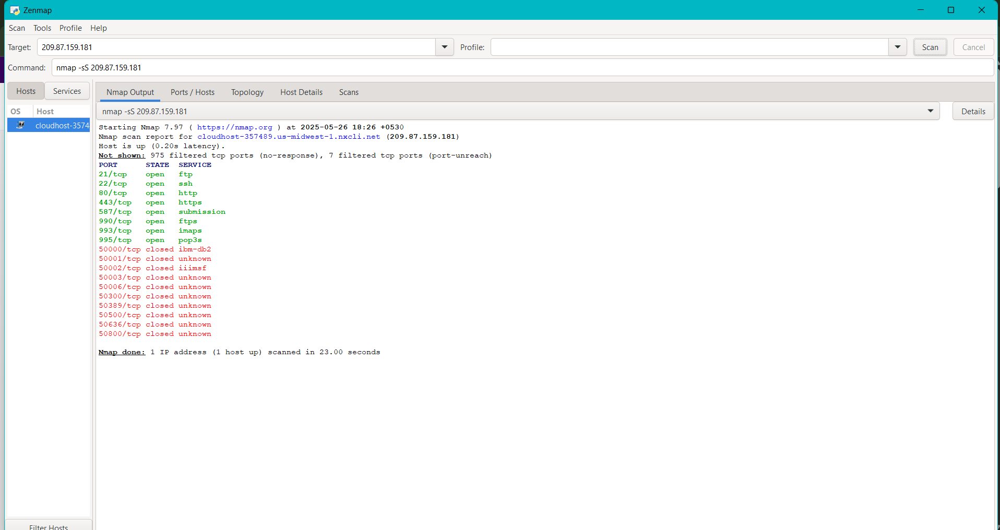
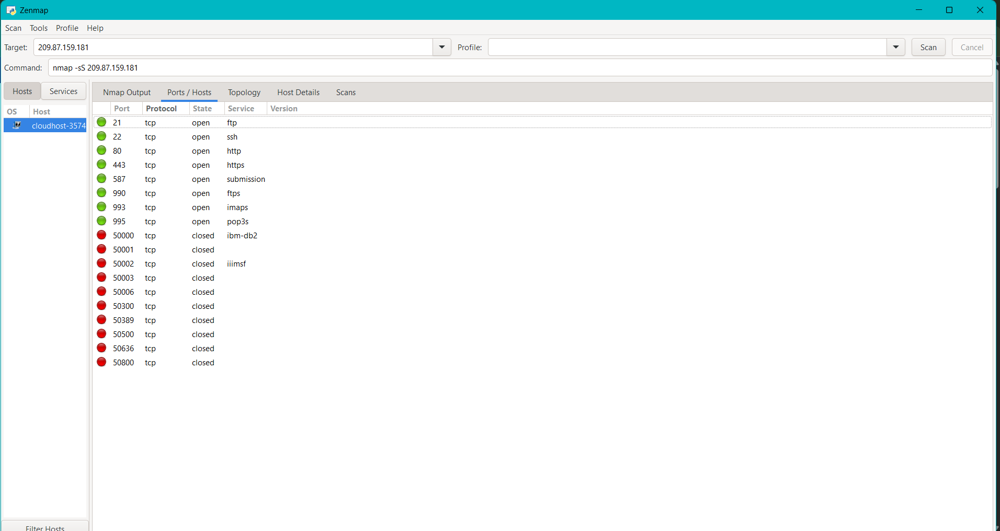

# nmap
using nmap tool 

<html>
<head>
<title>Open ports using nmap</title>
</head>
<body>
<h3>
Starting Nmap 7.97 ( https://nmap.org ) at 2025-05-26 18:26 +0530 
Nmap scan report for cloudhost-357489.us-midwest-1.nxcli.net (209.87.159.181) 
Host is up (0.20s latency). 
Not shown: 975 filtered tcp ports (no-response), 7 filtered tcp ports (port-unreach) 
 
PORT      STATE  SERVICE 
21/tcp    open   ftp 
22/tcp    open   ssh 
80/tcp    open   http 
443/tcp   open   https 
587/tcp   open   submission 
990/tcp   open   ftps 
993/tcp   open   imaps 
995/tcp   open   pop3s 
50001/tcp closed unknown 
50002/tcp closed iiimsf 
50003/tcp closed unknown 
50006/tcp closed unknown 
50300/tcp closed unknown 
50389/tcp closed unknown 
50500/tcp closed unknown 
50636/tcp closed unknown 
50800/tcp closed unknown 
 
Nmap done: 1 IP address (1 host up) scanned in 23.00 seconds 
  </h53>

</body>
</html>
